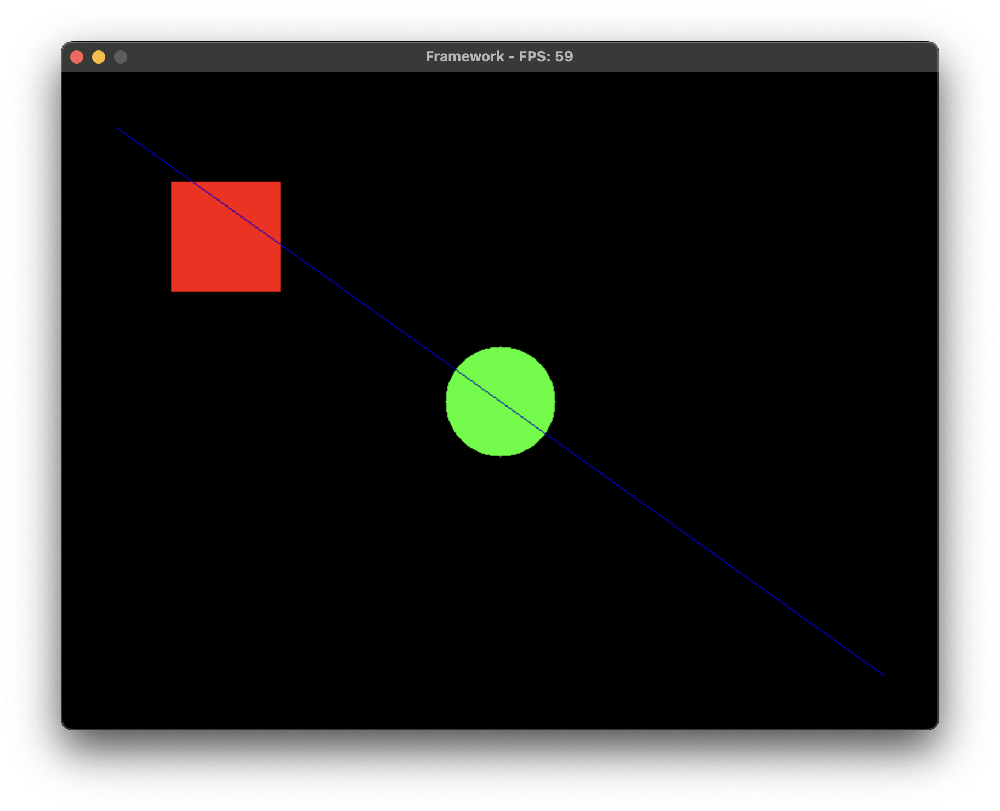

# SDL2 Game Framework

A lightweight 2D game framework built in **C** using **SDL2**. Perfect for rapid prototyping with real-time input handling and pixel-based rendering.



## Features

- Draw shapes: rectangles, circles, lines.
- Keyboard & Mouse input support.
- Real-time FPS counter in the window title.
- Custom rendering with pixel-level control.

## Controls

- **`R`**: Draw a red rectangle.
- **`C`**: Draw a green circle.
- **`L`**: Draw a blue line.
- **`Esc`**: Quit.

## Build and Run

1. Install **SDL2**.
2. Use CMake to build the project:
   ```bash
   mkdir build
   cd build
   cmake ..
   make
   ```
3. Run the executable:
   ```bash
   ./Main
   ```
